# PyRogue - シーケンス図

## 概要

このドキュメントでは、PyRogueの主要なゲームシステムにおけるコンポーネント間のやり取りをシーケンス図で視覚化しています。各システムの詳細な処理フローを理解し、実装時の参考として活用できます。

## 1. ゲームループシーケンス

### 1.1 メインゲームループ

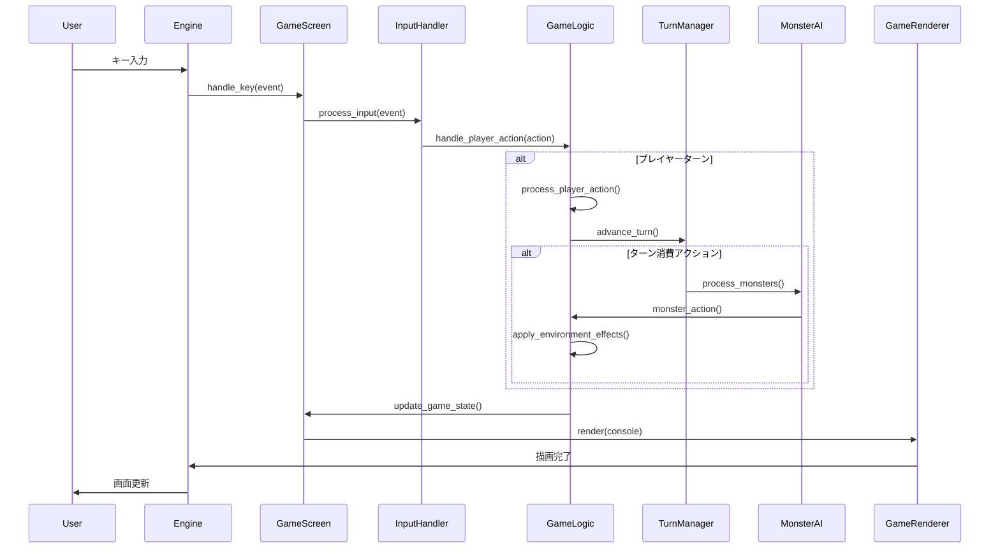

### 1.2 ターン管理詳細

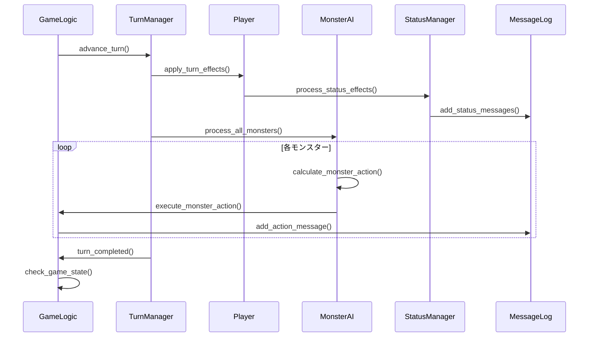

## 2. 戦闘システムシーケンス

### 2.1 プレイヤー攻撃フロー

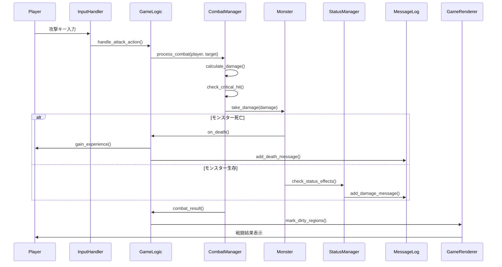

### 2.2 モンスターAI攻撃フロー

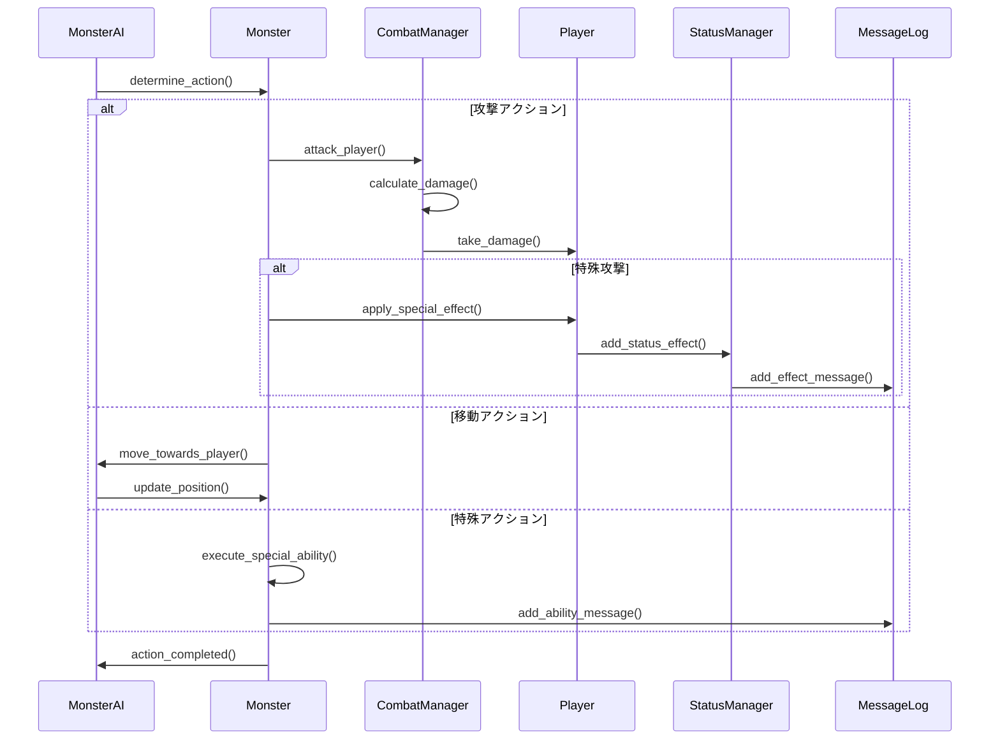

## 3. アイテムシステムシーケンス

### 3.1 アイテム使用フロー

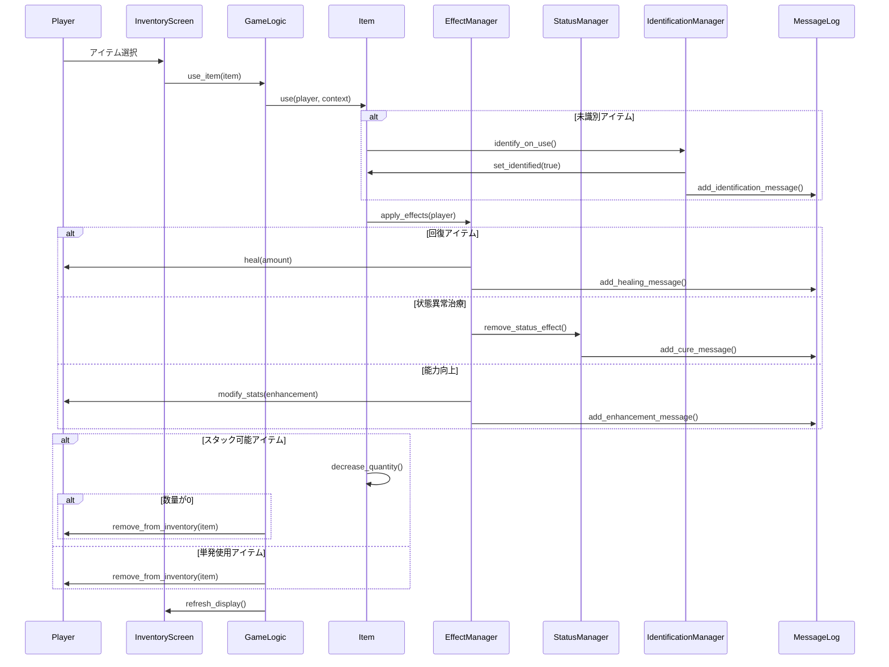

### 3.2 アイテム取得フロー

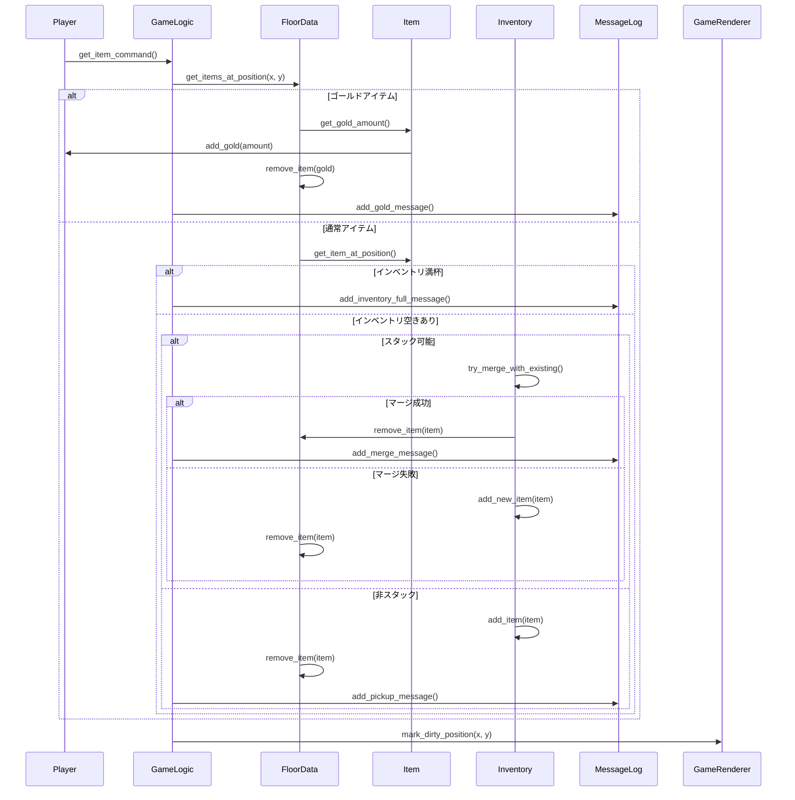

## 4. ダンジョン生成シーケンス

### 4.1 BSPダンジョン生成フロー

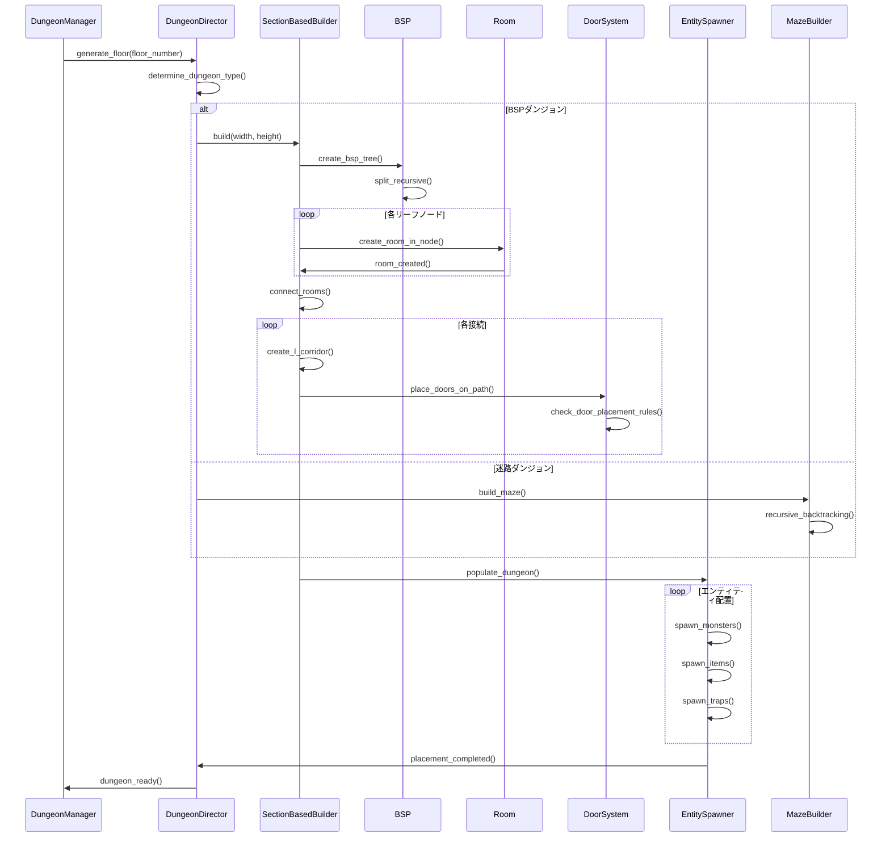

### 4.2 ドア配置システム詳細

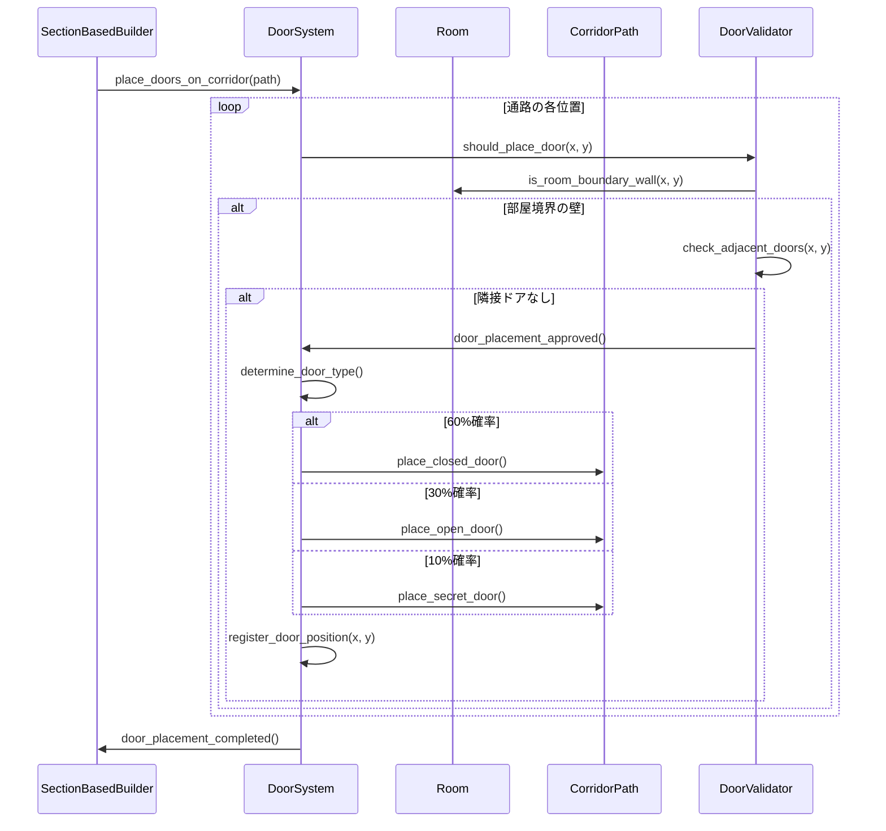

## 5. セーブ・ロードシステムシーケンス

### 5.1 ゲームセーブフロー

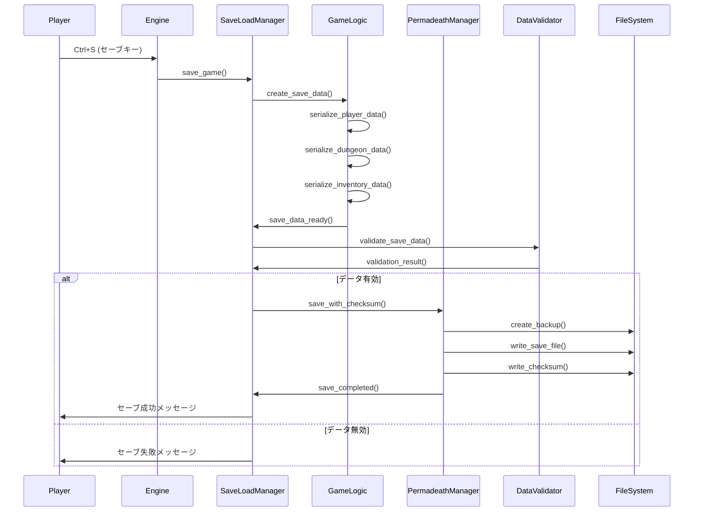

### 5.2 ゲームロードフロー

```mermaid
sequenceDiagram
    participant Player
    participant Engine
    participant SaveLoadManager
    participant PermadeathManager
    participant DataValidator
    parameter GameLogic
    participant FileSystem

    Player->>Engine: Ctrl+L (ロードキー)
    Engine->>SaveLoadManager: load_game()
    SaveLoadManager->>PermadeathManager: load_with_verification()

    PermadeathManager->>FileSystem: read_save_file()
    PermadeathManager->>FileSystem: read_checksum()
    PermadeathManager->>PermadeathManager: verify_checksum()

    alt チェックサム一致
        PermadeathManager->>SaveLoadManager: save_data_loaded()

    else チェックサム不一致
        PermadeathManager->>FileSystem: restore_from_backup()
        PermadeathManager->>PermadeathManager: verify_backup_checksum()

        alt バックアップ有効
            PermadeathManager->>SaveLoadManager: backup_data_loaded()
        else バックアップ無効
            PermadeathManager->>SaveLoadManager: load_failed()
        end
    end

    alt ロード成功
        SaveLoadManager->>DataValidator: validate_loaded_data()
        DataValidator->>SaveLoadManager: validation_result()

        alt データ有効
            SaveLoadManager->>GameLogic: restore_game_state()
            GameLogic->>GameLogic: deserialize_player_data()
            GameLogic->>GameLogic: deserialize_dungeon_data()
            GameLogic->>GameLogic: deserialize_inventory_data()
            GameLogic->>SaveLoadManager: game_state_restored()
            SaveLoadManager->>Player: ロード成功メッセージ

        else データ無効
            SaveLoadManager->>Player: データ破損メッセージ
        end
    else ロード失敗
        SaveLoadManager->>Player: ロード失敗メッセージ
    end
```

## 6. トラップシステムシーケンス

### 6.1 トラップ探索・解除フロー

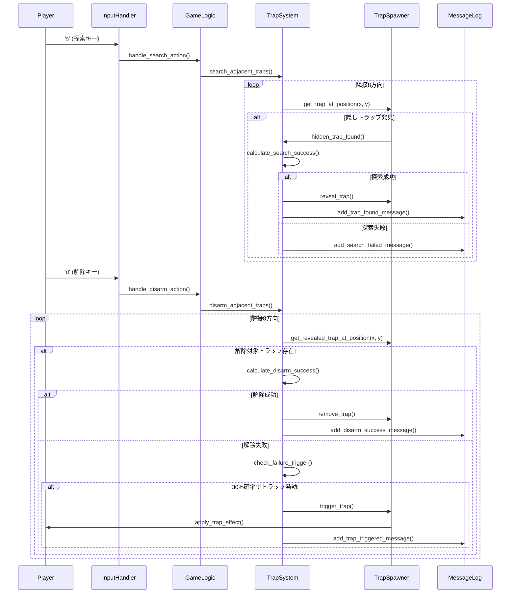

## 7. 魔法システムシーケンス

### 7.1 魔法詠唱フロー

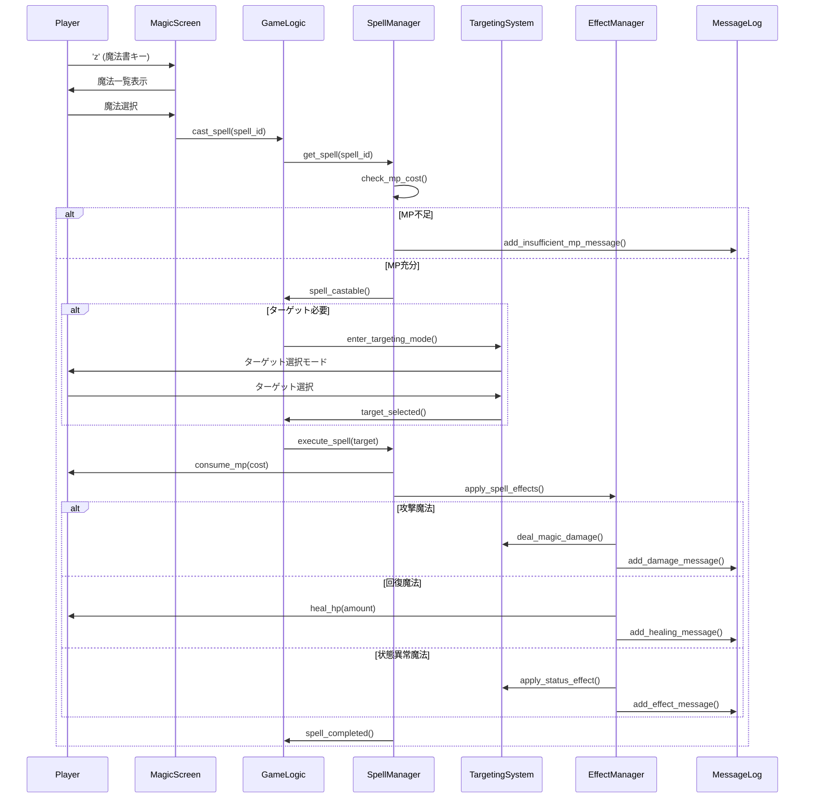

## 8. NPCシステムシーケンス（現在無効化中）

### 8.1 NPC対話フロー

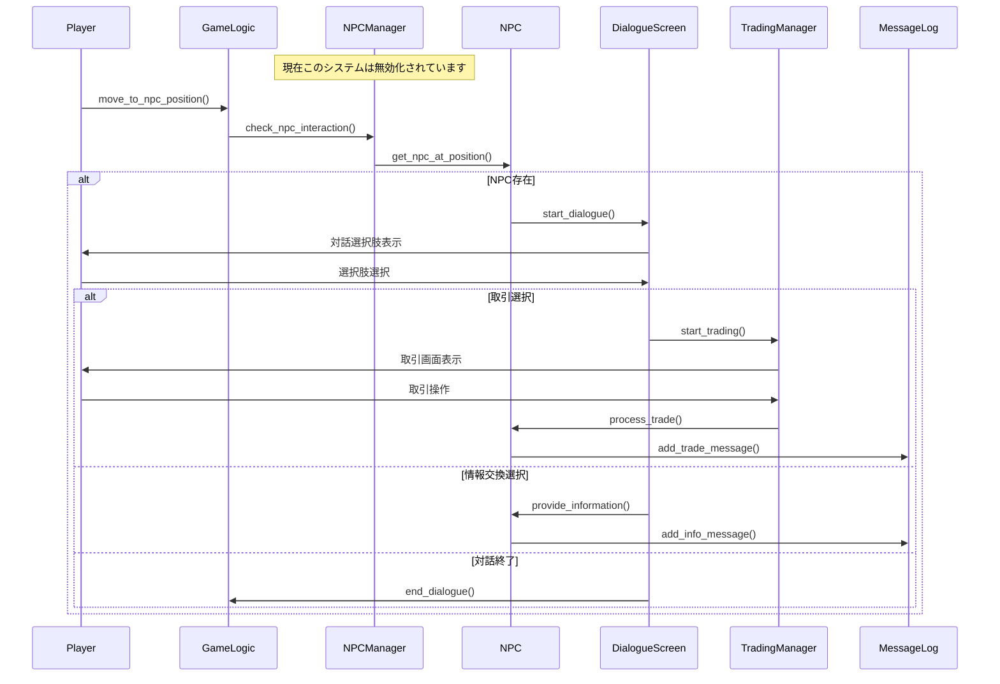

## まとめ

これらのシーケンス図は、PyRogueの主要システムにおけるコンポーネント間の相互作用を詳細に示しています。

### 🔄 **主要な設計パターン**
- **責務分離**: 各コンポーネントが明確な役割を持つ
- **メッセージパッシング**: 疎結合なコンポーネント間通信
- **状態管理**: 一貫した状態遷移の管理
- **エラーハンドリング**: 適切な例外処理とフォールバック

### 🎯 **システム間の連携**
- **ゲームループ**: 全システムを統合する中央制御
- **戦闘システム**: ダメージ計算と状態管理の統合
- **アイテムシステム**: インベントリと効果システムの連携
- **ダンジョン生成**: BSPアルゴリズムと配置システムの協調

### 🏗️ **実装への指針**
- 各シーケンス図は実装時の詳細な参考資料として活用可能
- コンポーネント間のインターフェース設計の指針を提供
- エラーケースと正常ケースの両方を考慮した設計
- 拡張性を考慮した柔軟なアーキテクチャの実現

これらの図は、開発チームがシステムの動作を理解し、一貫した実装を行うための重要な資料となります。
