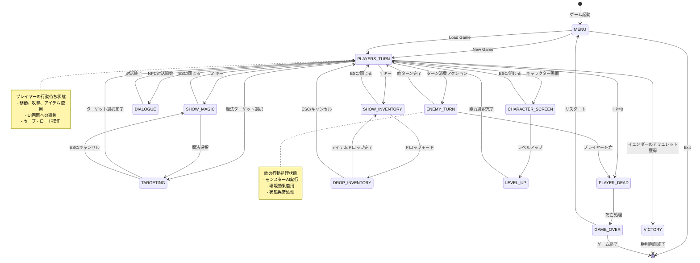
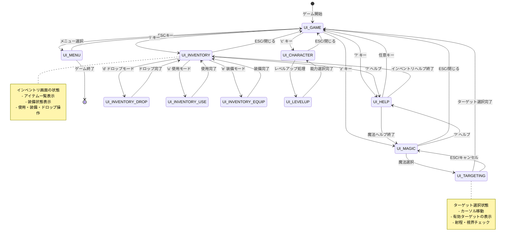
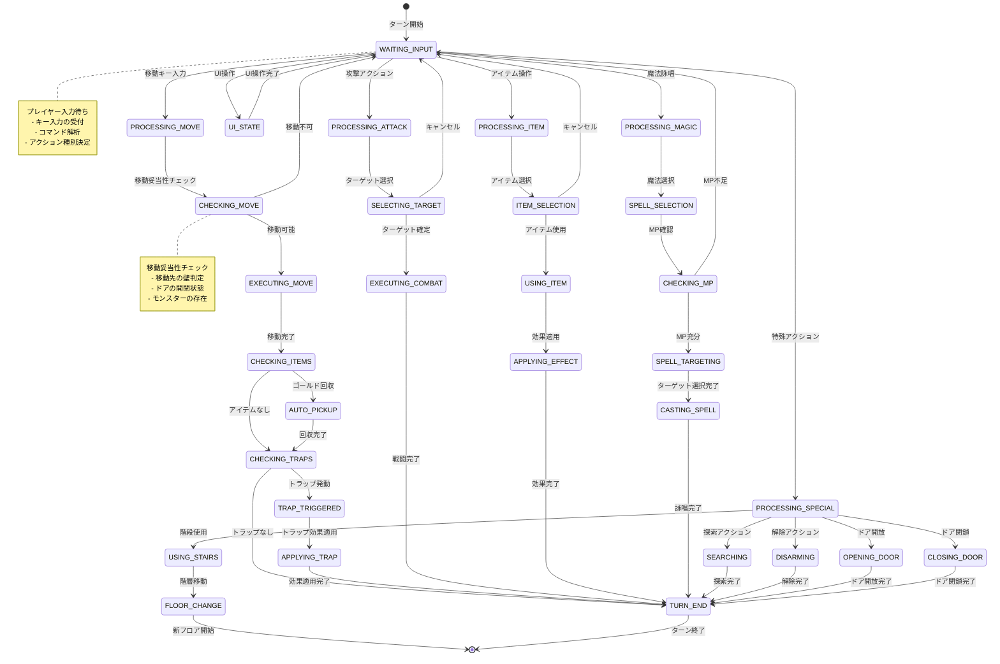
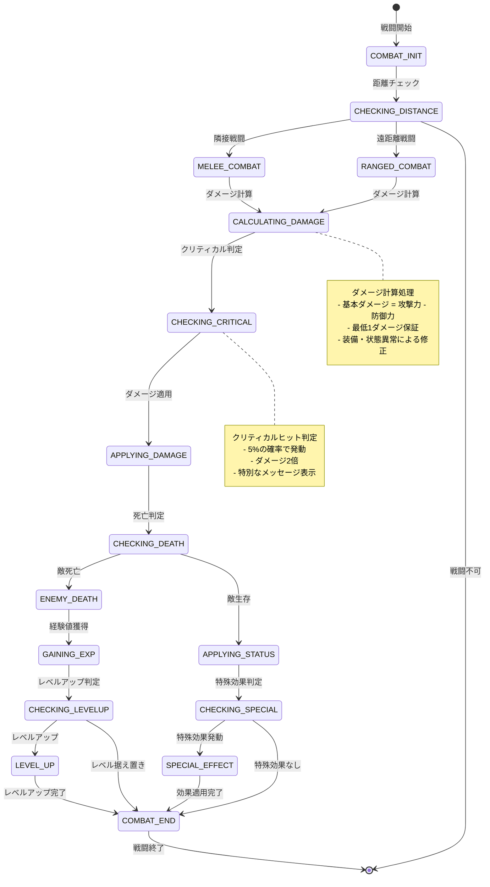
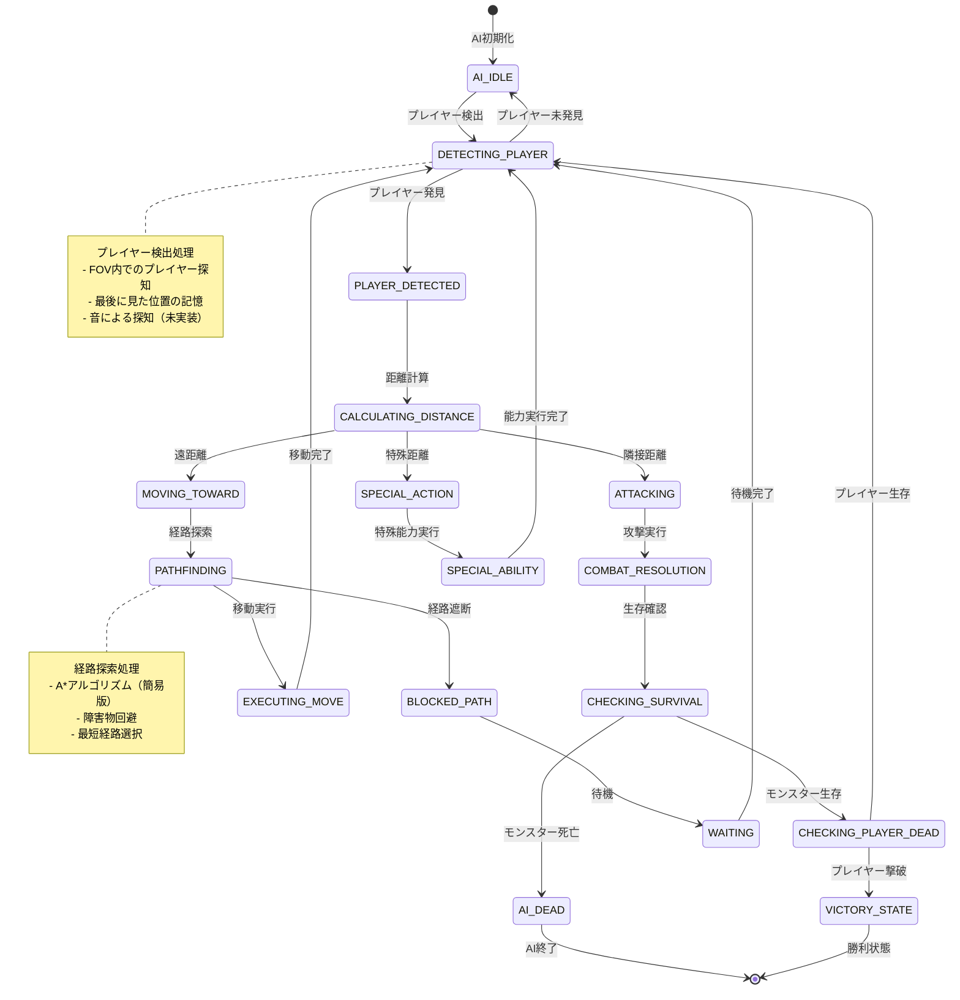
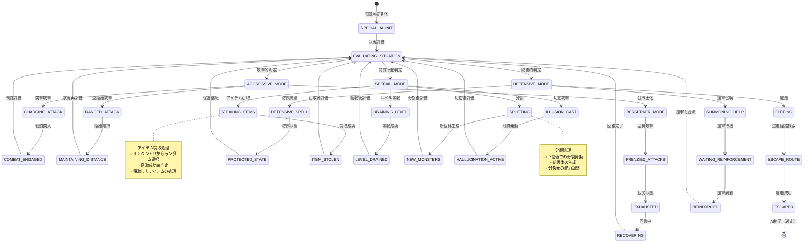
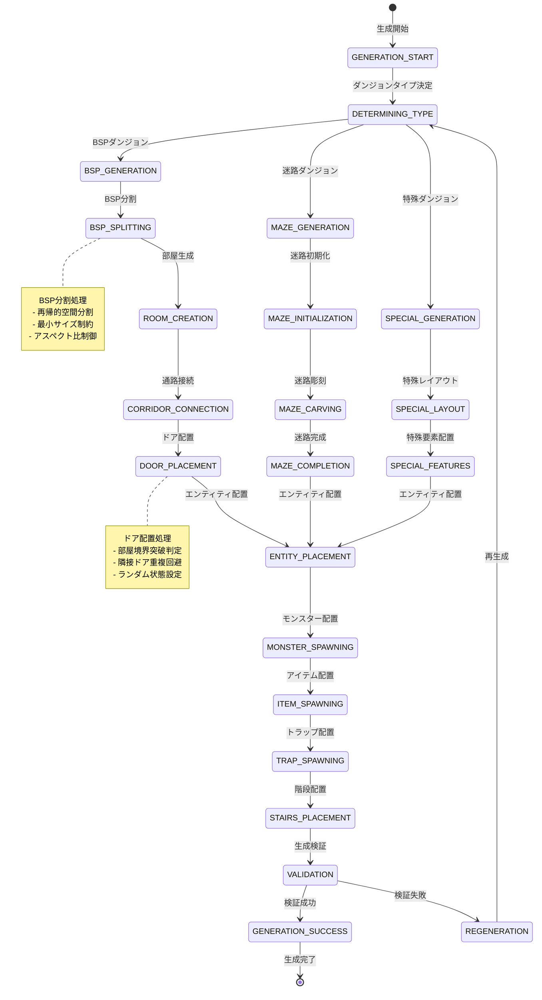
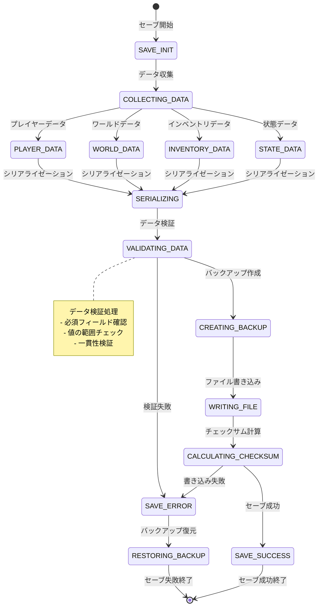
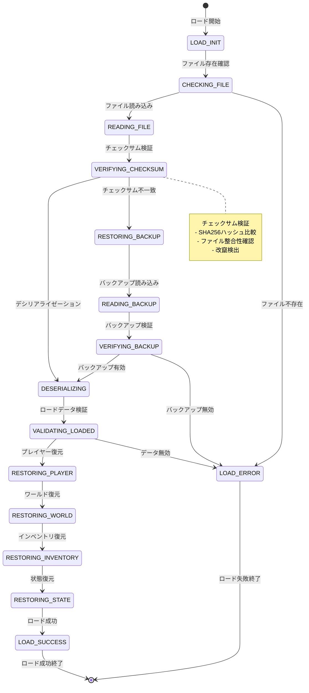
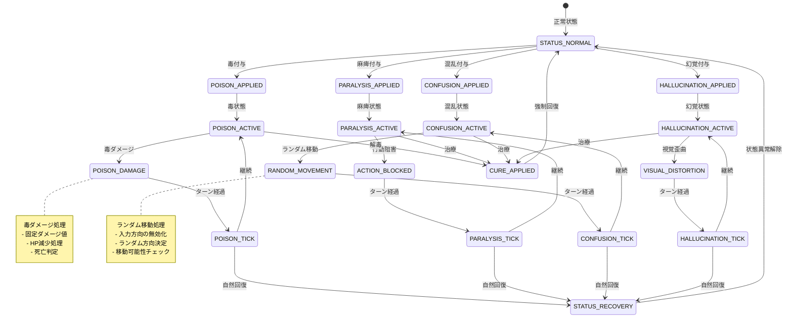

# PyRogue - ステートマシン図

## 概要

このドキュメントでは、PyRogueの各システムにおける状態遷移をステートマシン図で視覚化しています。ゲーム状態の管理、プレイヤーの行動フロー、UIの状態遷移、AIの行動パターンを明確に定義し、実装時の状態管理の指針を提供します。

## 1. ゲーム全体状態遷移

### 1.1 メインゲーム状態遷移

### 1.2 UI状態詳細遷移

## 2. プレイヤー行動状態遷移

### 2.1 プレイヤーターン詳細状態

### 2.2 戦闘状態遷移

## 3. モンスターAI状態遷移

### 3.1 基本モンスターAI

### 3.2 特殊モンスターAI状態

## 4. ダンジョン生成状態遷移

### 4.1 ダンジョン生成プロセス

## 5. セーブ・ロード状態遷移

### 5.1 セーブシステム状態

### 5.2 ロードシステム状態

## 6. 状態異常システム遷移

### 6.1 状態異常管理

## まとめ

これらのステートマシン図は、PyRogueの各システムにおける状態管理の詳細を視覚化しています。

### 🔄 **状態管理の設計原則**
- **明確な状態定義**: 各状態の責務と条件を明確化
- **予測可能な遷移**: 一貫した状態遷移ルール
- **エラー処理**: 異常状態への適切な対応
- **拡張性**: 新しい状態の追加容易性

### 🎯 **主要なシステム状態**
- **ゲーム状態**: 全体的なゲーム進行の管理
- **プレイヤー状態**: プレイヤーの行動と状態の詳細管理
- **AI状態**: モンスターの行動パターンと判断プロセス
- **UI状態**: ユーザーインターフェースの状態管理

### 🏗️ **実装への指針**
- 各ステートマシンは実装時の状態管理クラスの設計指針
- 状態遷移条件の明確な定義により、バグの少ない実装を実現
- エラー状態とリカバリ処理の体系的な設計
- テスト時の状態カバレッジの指針として活用可能

これらの図は、開発チームが一貫した状態管理を実装し、PyRogueの高い品質と安定性を維持するための重要な設計資料となります。
